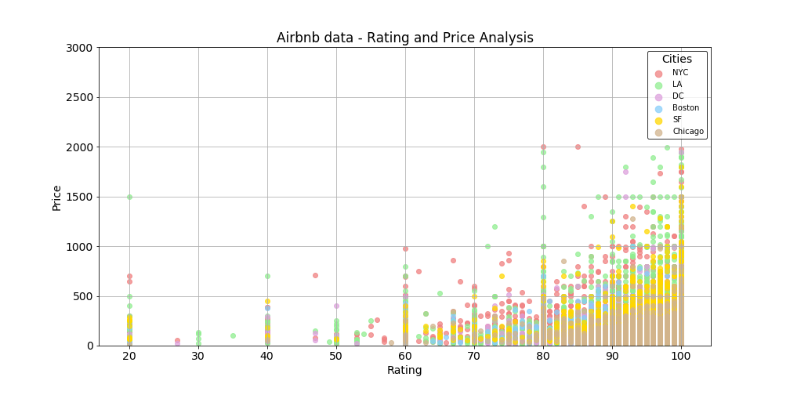
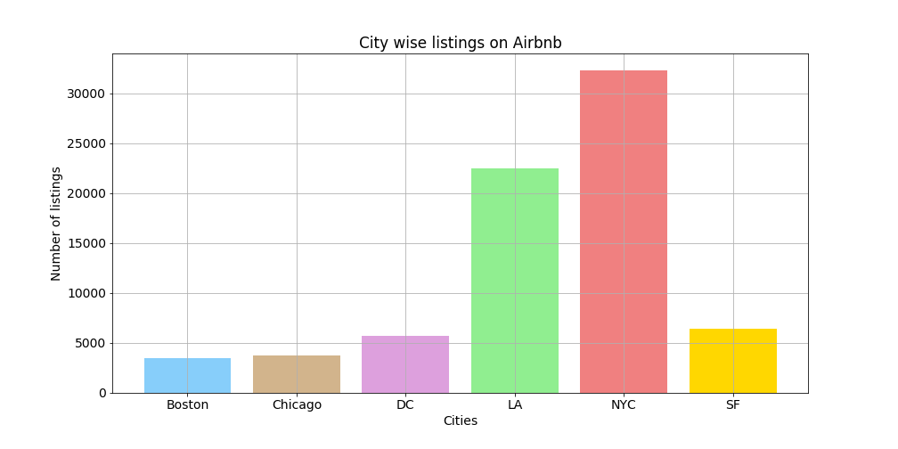
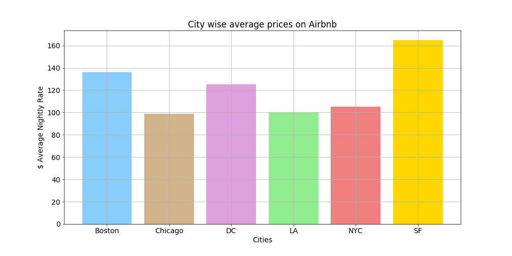
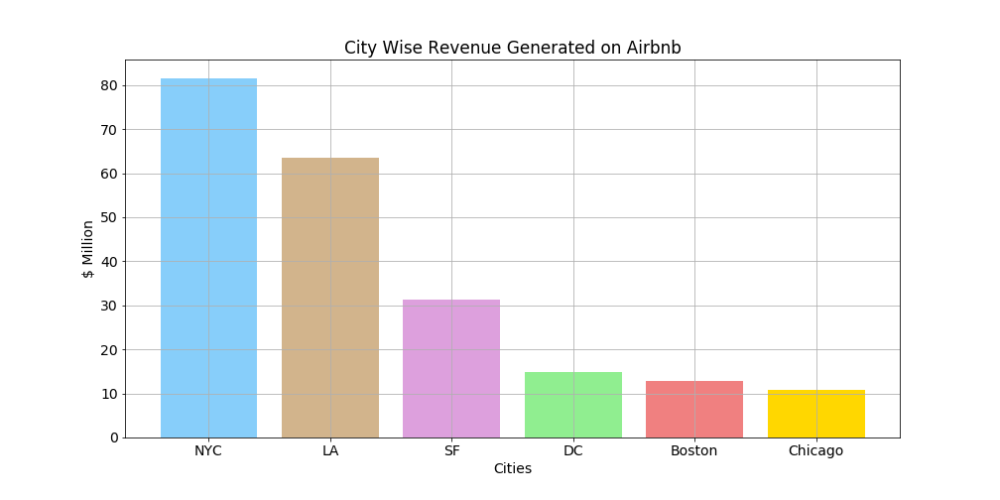
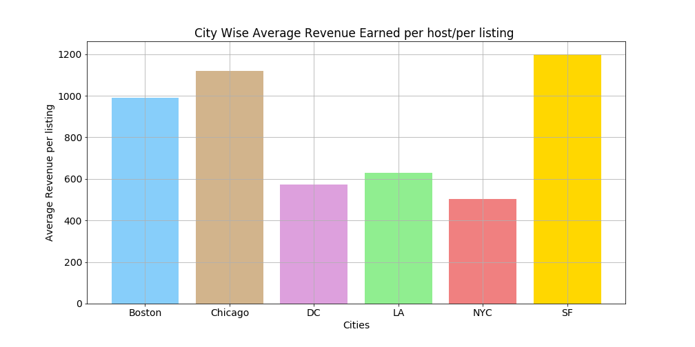
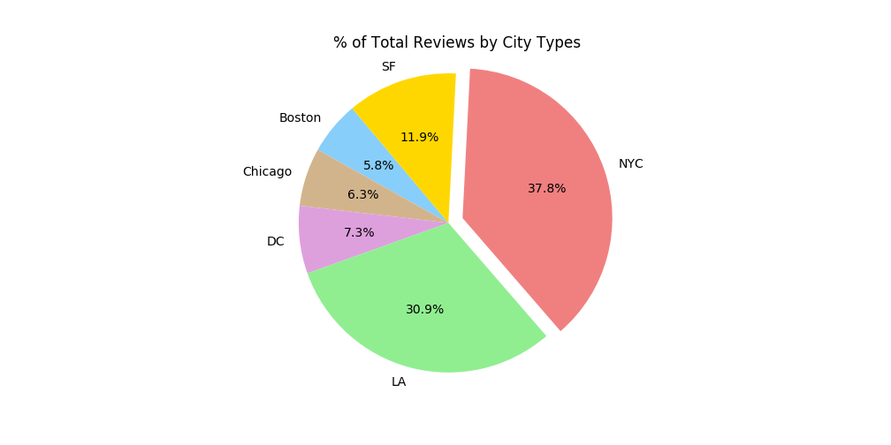
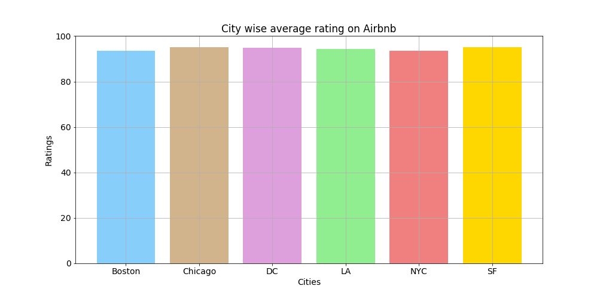

# How Can Airbnb Hosts Improve their Profitability and Ratings ?
## Strategy and Metrics:
Airbnb Hosts:
* All property owners in the US who have listed their properties on Airbnb.
* Everyone in the US who is intending to invest in Airbnb properties.
Profitability:
* Airbnb earnings based on the number of reviews on a listing and their nightly price.
Ratings:
* Number of Reviews on Airbnb
* Average aggregated ratings on the 0-100 scale (ratings can be divided by 20 to get star ratings on a 0-5 scale)

In this project, we have organized and analyzed a database of around **74,000 listings** in **6 cities in the US**; in an attempt to discover any trends on how **Host Profits** and **User Ratings** vary across **Locations, Property Types and Amenities.**

#### Data Source:
Kaggle
#### Data Exploration, Cleanup, Analysis and Visualization Tools:
Pandas
Numpy
Matplotlib
### Collaboration Tools:
Github
Slack
Google Slides

## Location Analysis
* What cities have the most listings?
* What cities have the highest nightly price on average?
* Which city brings in the most revenue?
* Where do Airbnb hosts make the most money?
* Do user ratings vary across different locations?

## Property Type Analysis
* What property types have the most listings?
* How does the price of the rental space get affected by its property type?
* Do property types affect user ratings?

## Amenities Analysis
* Does inclusion of certain amenities correlate with a higher customer rating?
* Does inclusion of certain amenities have any noticeable effect on customer ratings for different property types?
* Does inclusion of certain amenities have an effect on the price for different property types?


```python
# Importing dependencies
%matplotlib inline
import pandas as pd
import numpy as np
import matplotlib.pyplot as plt 
filepath = "train.csv"
airbnb_data = pd.read_csv(filepath) 
```


```python
# Set some parameters to apply to all plots. These can be overridden in each plot if desired
# Plot size to 14" x 7"
plt.rc('figure', figsize = (14,7))
 
# Font size to 14
plt.rc('font', size = 14)

# Set backgound color to white
plt.rc('axes', facecolor = 'white')

# Incorporate the other graph properties
plt.rc('axes.spines',right = True)
plt.rc('axes', grid = True)
```

# Exploring & Cleaning Data


```python
airbnb_data.columns
```


    Index(['id', 'log_price', 'property_type', 'room_type', 'amenities',
           'accommodates', 'bathrooms', 'bed_type', 'cancellation_policy',
           'cleaning_fee', 'city', 'description', 'first_review',
           'host_has_profile_pic', 'host_identity_verified', 'host_response_rate',
           'host_since', 'instant_bookable', 'last_review', 'latitude',
           'longitude', 'name', 'neighbourhood', 'number_of_reviews',
           'review_scores_rating', 'thumbnail_url', 'zipcode', 'bedrooms', 'beds'],
          dtype='object')


```python
#airbnb_data.dtypes
#airbnb_data.isnull()
#airbnb_data.inna()
#airbnb_data.head()
```


```python
airbnb_data["coordinates"] = list(zip(airbnb_data.latitude, airbnb_data.longitude))
```


```python
# Creating a column to convert natural log price in real price
real_price = []
for x in airbnb_data["log_price"]:
    price = np.exp(x)
    real_price.append(price)
price_series = pd.Series(real_price)
```


```python
airbnb_data["price"] = price_series
```


```python
#airbnb_data[["log_price","price"]]
```


```python
# Creating a dataframe to avoid listings with no reviews
#airbnb_data_cleaned = airbnb_data.loc[airbnb_data["number_of_reviews"] > 0]
#airbnb_data_cleaned.head(2)
```


```python
# To estimate range of earning assuming that 
# every person who stayed at the property reviewed it:
airbnb_data["revenue"] = airbnb_data["number_of_reviews"] * airbnb_data["price"]
#airbnb_data[["number_of_reviews","price","test"]]
```


```python
# NYC data
nyc_data = airbnb_data.loc[airbnb_data["city"] == "NYC"]
nyc_price = nyc_data["price"]
nyc_rating = nyc_data['review_scores_rating']
# SF data
sf_data = airbnb_data.loc[airbnb_data["city"] == "SF"]
sf_price = sf_data["price"]
sf_rating = sf_data['review_scores_rating']
# Boston data
boston_data = airbnb_data.loc[airbnb_data["city"] == "Boston"]
boston_price = boston_data["price"]
boston_rating = boston_data['review_scores_rating']
# Chicago data
chicago_data = airbnb_data.loc[airbnb_data["city"] == "Chicago"]
chicago_price = chicago_data["price"]
chicago_rating = chicago_data['review_scores_rating']
# DC data
dc_data = airbnb_data.loc[airbnb_data["city"] == "DC"]
dc_price = dc_data["price"]
dc_rating = dc_data['review_scores_rating']
# LA data
la_data = airbnb_data.loc[airbnb_data["city"] == "LA"]
la_price = la_data["price"]
la_rating = la_data['review_scores_rating']
```


```python

fig1 = plt.scatter(nyc_rating,nyc_price,color="lightcoral",alpha=0.75, label="NYC")
fig2 = plt.scatter(la_rating,la_price,color="lightgreen",alpha=0.75,label="LA")
fig3 = plt.scatter(dc_rating,dc_price, color="plum",alpha=0.75,label="DC")
fig4 = plt.scatter(boston_rating,boston_price, color="lightskyblue",alpha=0.75,label="Boston")
fig5 = plt.scatter(sf_rating,sf_price, color="gold",alpha=0.75,label="SF")
fig6 = plt.scatter(chicago_rating,chicago_price, color="tan",alpha=0.75,label="Chicago")
plt.ylim(0,3000)
# Create a legend
lgnd = plt.legend(loc="best", fontsize=10, edgecolor="black", title="Cities")
for handle in lgnd.legendHandles:
    handle.set_sizes([75.0])
#plt.gcf().text(0.92, 0.5, "Note:\nCircle size correlates with -----.", fontsize=14)
plt.title("Airbnb data - Rating and Price Analysis")
plt.xlabel("Rating")
plt.ylabel("Price")

plt.savefig('airbnb_locations.png')
plt.show()
```





# Location Analysis


```python
# Total number of listings per city
listings_cities = airbnb_data.groupby("city")["id"].count().reset_index(name="listings_count")
listings_cities.head()
```
<style scoped> .dataframe tbody tr th:only-of-type { vertical-align: middle; } .dataframe tbody tr th { vertical-align: top; } .dataframe thead th { text-align: right; } </style>

<div>
<style scoped>
    .dataframe tbody tr th:only-of-type {
        vertical-align: middle;
    }

    .dataframe tbody tr th {
        vertical-align: top;
    }

    .dataframe thead th {
        text-align: right;
    }
</style>
<table border="1" class="dataframe">
  <thead>
    <tr style="text-align: right;">
      <th></th>
      <th>city</th>
      <th>listings_count</th>
    </tr>
  </thead>
  <tbody>
    <tr>
      <th>0</th>
      <td>Boston</td>
      <td>3468</td>
    </tr>
    <tr>
      <th>1</th>
      <td>Chicago</td>
      <td>3719</td>
    </tr>
    <tr>
      <th>2</th>
      <td>DC</td>
      <td>5688</td>
    </tr>
    <tr>
      <th>3</th>
      <td>LA</td>
      <td>22453</td>
    </tr>
    <tr>
      <th>4</th>
      <td>NYC</td>
      <td>32349</td>
    </tr>
  </tbody>
</table>
</div>


```python
# x axis and tick locations
x_axis = np.arange(len(listings_cities))
tick_locations = [value for value in x_axis]
colors = ["lightskyblue","tan","plum","lightgreen","lightcoral","gold"]


# Creating a bar
plt.bar(x_axis, listings_cities["listings_count"], color=colors,align="center")
plt.xticks(tick_locations, listings_cities["city"])

# Setting a Title and labels
plt.title("City wise listings on Airbnb")
plt.xlabel("Cities")
plt.ylabel("Number of listings")


plt.savefig("number_of_listings_per_city.png")
plt.show()
```





```python
# Average price per city
# Checking the spread of data to decide between mean and median measures
#airbnb_data.groupby("city")["price"].min()
#airbnb_data.groupby("city")["price"].max()

avg_prc_per_city = airbnb_data.groupby("city")["price"].median().reset_index(name="price")
avg_prc_per_city
```


<div>
<style scoped>
    .dataframe tbody tr th:only-of-type {
        vertical-align: middle;
    }

    .dataframe tbody tr th {
        vertical-align: top;
    }

    .dataframe thead th {
        text-align: right;
    }
</style>
<table border="1" class="dataframe">
  <thead>
    <tr style="text-align: right;">
      <th></th>
      <th>city</th>
      <th>price</th>
    </tr>
  </thead>
  <tbody>
    <tr>
      <th>0</th>
      <td>Boston</td>
      <td>136.0</td>
    </tr>
    <tr>
      <th>1</th>
      <td>Chicago</td>
      <td>99.0</td>
    </tr>
    <tr>
      <th>2</th>
      <td>DC</td>
      <td>125.0</td>
    </tr>
    <tr>
      <th>3</th>
      <td>LA</td>
      <td>100.0</td>
    </tr>
    <tr>
      <th>4</th>
      <td>NYC</td>
      <td>105.0</td>
    </tr>
    <tr>
      <th>5</th>
      <td>SF</td>
      <td>165.0</td>
    </tr>
  </tbody>
</table>
</div>


```python
# x axis and tick locations
x_axis = np.arange(len(avg_prc_per_city))
tick_locations = [value for value in x_axis]
colors = ["lightskyblue","tan","plum","lightgreen","lightcoral","gold"]

# Creating a bar
plt.bar(x_axis, avg_prc_per_city["price"], color=colors, align="center")
plt.xticks(tick_locations, avg_prc_per_city["city"])

# Setting a Title and labels
plt.title("City wise average prices on Airbnb")
plt.xlabel("Cities")
plt.ylabel("$ Average Nightly Rate")

# Saving and showing the graph
plt.savefig("prices_per_city.png")
plt.show()
```





```python
# THIS IS NOT AN ACCURATE ANALYSIS - It is done with an assumption that each listing had as many customers 
# as it's review count, and each customer stayed only one night
# the analysis includes only nightly rate and 
# it does not include cleaning fees or other additional charges

revenue_city = airbnb_data.groupby("city")["revenue"].sum().reset_index().sort_values(by="revenue", ascending=False)
revenue_city
revenue_city["revenue in Millions"] = (revenue_city['revenue'].astype(float)/1000000).round(2)
revenue_city
```


<div>
<style scoped>
    .dataframe tbody tr th:only-of-type {
        vertical-align: middle;
    }

    .dataframe tbody tr th {
        vertical-align: top;
    }

    .dataframe thead th {
        text-align: right;
    }
</style>
<table border="1" class="dataframe">
  <thead>
    <tr style="text-align: right;">
      <th></th>
      <th>city</th>
      <th>revenue</th>
      <th>revenue in Millions</th>
    </tr>
  </thead>
  <tbody>
    <tr>
      <th>4</th>
      <td>NYC</td>
      <td>81611462.0</td>
      <td>81.61</td>
    </tr>
    <tr>
      <th>3</th>
      <td>LA</td>
      <td>63494726.0</td>
      <td>63.49</td>
    </tr>
    <tr>
      <th>5</th>
      <td>SF</td>
      <td>31249446.0</td>
      <td>31.25</td>
    </tr>
    <tr>
      <th>2</th>
      <td>DC</td>
      <td>14950137.0</td>
      <td>14.95</td>
    </tr>
    <tr>
      <th>0</th>
      <td>Boston</td>
      <td>12855401.0</td>
      <td>12.86</td>
    </tr>
    <tr>
      <th>1</th>
      <td>Chicago</td>
      <td>10712417.0</td>
      <td>10.71</td>
    </tr>
  </tbody>
</table>
</div>


```python
# x axis and tick locations
x_axis = np.arange(len(revenue_city))
tick_locations = [value for value in x_axis]
colors = ["lightskyblue","tan","plum","lightgreen","lightcoral","gold"]

# Creating a bar
plt.bar(x_axis, revenue_city["revenue in Millions"], color= colors, align="center")
plt.xticks(tick_locations, revenue_city["city"])
#plt.yticks(tick_locations, revenue_city["revenue in Millions"])

# Setting a Title and labels
plt.title("City Wise Revenue Generated on Airbnb")
plt.xlabel("Cities")
plt.ylabel ("$ Million")

#plt.ylim(0,100)

# Saving and showing the graph
plt.savefig("revenue_per_city.png")
plt.show()
```





```python
revenue_by_city = airbnb_data.groupby("city")["revenue"].median().reset_index()
revenue_by_city
```


<div>
<style scoped>
    .dataframe tbody tr th:only-of-type {
        vertical-align: middle;
    }

    .dataframe tbody tr th {
        vertical-align: top;
    }

    .dataframe thead th {
        text-align: right;
    }
</style>
<table border="1" class="dataframe">
  <thead>
    <tr style="text-align: right;">
      <th></th>
      <th>city</th>
      <th>revenue</th>
    </tr>
  </thead>
  <tbody>
    <tr>
      <th>0</th>
      <td>Boston</td>
      <td>990.0</td>
    </tr>
    <tr>
      <th>1</th>
      <td>Chicago</td>
      <td>1120.0</td>
    </tr>
    <tr>
      <th>2</th>
      <td>DC</td>
      <td>571.5</td>
    </tr>
    <tr>
      <th>3</th>
      <td>LA</td>
      <td>629.0</td>
    </tr>
    <tr>
      <th>4</th>
      <td>NYC</td>
      <td>504.0</td>
    </tr>
    <tr>
      <th>5</th>
      <td>SF</td>
      <td>1200.0</td>
    </tr>
  </tbody>
</table>
</div>


```python
# x axis and tick locations
x_axis = np.arange(len(revenue_by_city))
tick_locations = [value for value in x_axis]
colors = ["lightskyblue","tan","plum","lightgreen","lightcoral","gold"]

# Creating a bar
plt.bar(x_axis, revenue_by_city["revenue"], color= colors, align="center")
plt.xticks(tick_locations, revenue_by_city["city"])

# Setting a Title and labels
plt.title("City Wise Average Revenue Earned per host/per listing ")
plt.xlabel("Cities")
plt.ylabel("Average Revenue per listing")

# Saving and showing the graph
plt.savefig("revenue_per_listing.png")
plt.show()
```





```python
# Total number of reviews per city
reviews_per_city = airbnb_data.groupby("city")["number_of_reviews"].sum().reset_index(name="number_of_reviews")
reviews_per_city.head()
```


<div>
<style scoped>
    .dataframe tbody tr th:only-of-type {
        vertical-align: middle;
    }

    .dataframe tbody tr th {
        vertical-align: top;
    }

    .dataframe thead th {
        text-align: right;
    }
</style>
<table border="1" class="dataframe">
  <thead>
    <tr style="text-align: right;">
      <th></th>
      <th>city</th>
      <th>number_of_reviews</th>
    </tr>
  </thead>
  <tbody>
    <tr>
      <th>0</th>
      <td>Boston</td>
      <td>89094</td>
    </tr>
    <tr>
      <th>1</th>
      <td>Chicago</td>
      <td>97571</td>
    </tr>
    <tr>
      <th>2</th>
      <td>DC</td>
      <td>113204</td>
    </tr>
    <tr>
      <th>3</th>
      <td>LA</td>
      <td>478360</td>
    </tr>
    <tr>
      <th>4</th>
      <td>NYC</td>
      <td>586203</td>
    </tr>
  </tbody>
</table>
</div>


```python
merge_1 = pd.merge(avg_prc_per_city,listings_cities,on="city", how="inner")
merge_2= pd.merge(merge_1,reviews_per_city, on="city", how="inner")
combined_data = pd.merge(merge_2,avg_review_city,on="city",how="inner")
combined_data
```


<div>
<style scoped>
    .dataframe tbody tr th:only-of-type {
        vertical-align: middle;
    }

    .dataframe tbody tr th {
        vertical-align: top;
    }

    .dataframe thead th {
        text-align: right;
    }
</style>
<table border="1" class="dataframe">
  <thead>
    <tr style="text-align: right;">
      <th></th>
      <th>city</th>
      <th>price</th>
      <th>listings_count</th>
      <th>number_of_reviews</th>
      <th>rating</th>
    </tr>
  </thead>
  <tbody>
    <tr>
      <th>0</th>
      <td>Boston</td>
      <td>165.631488</td>
      <td>3468</td>
      <td>89094</td>
      <td>93.597518</td>
    </tr>
    <tr>
      <th>1</th>
      <td>Chicago</td>
      <td>132.476472</td>
      <td>3719</td>
      <td>97571</td>
      <td>95.102868</td>
    </tr>
    <tr>
      <th>2</th>
      <td>DC</td>
      <td>217.933368</td>
      <td>5688</td>
      <td>113204</td>
      <td>94.827317</td>
    </tr>
    <tr>
      <th>3</th>
      <td>LA</td>
      <td>155.388233</td>
      <td>22453</td>
      <td>478360</td>
      <td>94.305714</td>
    </tr>
    <tr>
      <th>4</th>
      <td>NYC</td>
      <td>143.024576</td>
      <td>32349</td>
      <td>586203</td>
      <td>93.506553</td>
    </tr>
    <tr>
      <th>5</th>
      <td>SF</td>
      <td>227.372552</td>
      <td>6434</td>
      <td>184530</td>
      <td>95.023777</td>
    </tr>
  </tbody>
</table>
</div>


```python
# Creating pie chart based on above data
cities = combined_data["city"]
review_count_by_city = combined_data["number_of_reviews"]
colors = ["lightskyblue","tan","plum","lightgreen","lightcoral","gold"]
explode = (0,0,0,0,0.1,0)
plt.pie(review_count_by_city, explode=explode, labels=cities,colors=colors,autopct="%1.1f%%",shadow=False,startangle=130)
plt.title("% of Total Reviews by City Types")
plt.axis("equal")
plt.savefig("review_count_by_city.png")
plt.show()
```





```python
# Average Review Rating per city
# Using data with more than 5 reviews to avoid bias and getting misrespresented average rating
avg_review_city = airbnb_data.groupby("city")["review_scores_rating"].mean().reset_index(name="rating")
avg_review_city.head()
```


<div>
<style scoped>
    .dataframe tbody tr th:only-of-type {
        vertical-align: middle;
    }

    .dataframe tbody tr th {
        vertical-align: top;
    }

    .dataframe thead th {
        text-align: right;
    }
</style>
<table border="1" class="dataframe">
  <thead>
    <tr style="text-align: right;">
      <th></th>
      <th>city</th>
      <th>rating</th>
    </tr>
  </thead>
  <tbody>
    <tr>
      <th>0</th>
      <td>Boston</td>
      <td>93.597518</td>
    </tr>
    <tr>
      <th>1</th>
      <td>Chicago</td>
      <td>95.102868</td>
    </tr>
    <tr>
      <th>2</th>
      <td>DC</td>
      <td>94.827317</td>
    </tr>
    <tr>
      <th>3</th>
      <td>LA</td>
      <td>94.305714</td>
    </tr>
    <tr>
      <th>4</th>
      <td>NYC</td>
      <td>93.506553</td>
    </tr>
  </tbody>
</table>
</div>


```python
# x axis and tick locations
x_axis = np.arange(len(avg_review_city))
tick_locations = [value for value in x_axis]
colors = ["lightskyblue","tan","plum","lightgreen","lightcoral","gold"]

# Creating a bar
plt.bar(x_axis, avg_review_city["rating"], color= colors, align="center")
plt.xticks(tick_locations, avg_review_city["city"])

# Setting a Title and labels
plt.title("City wise average rating on Airbnb")
plt.xlabel("Cities")
plt.ylabel("Ratings")
plt.ylim(0,100)

# Saving and showing the graph
plt.savefig("ratings_per_city.png")
plt.show()
```





